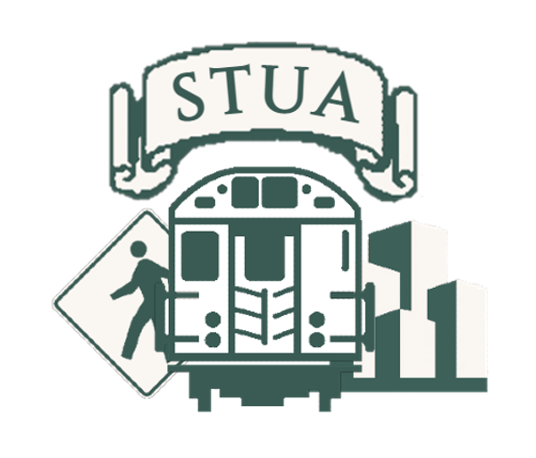
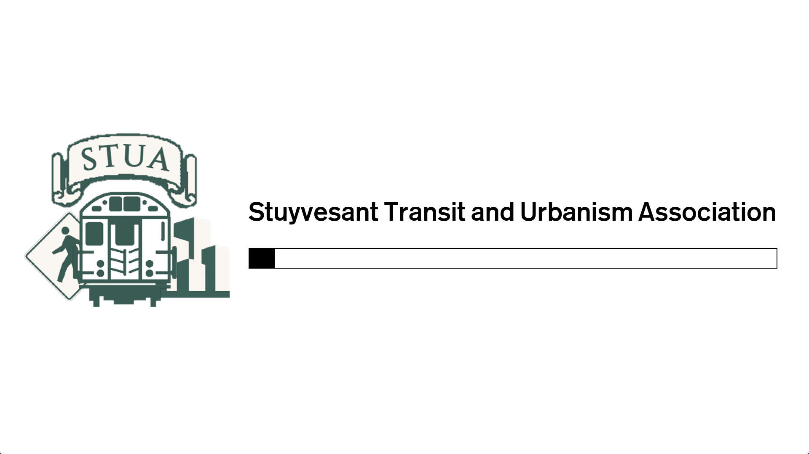
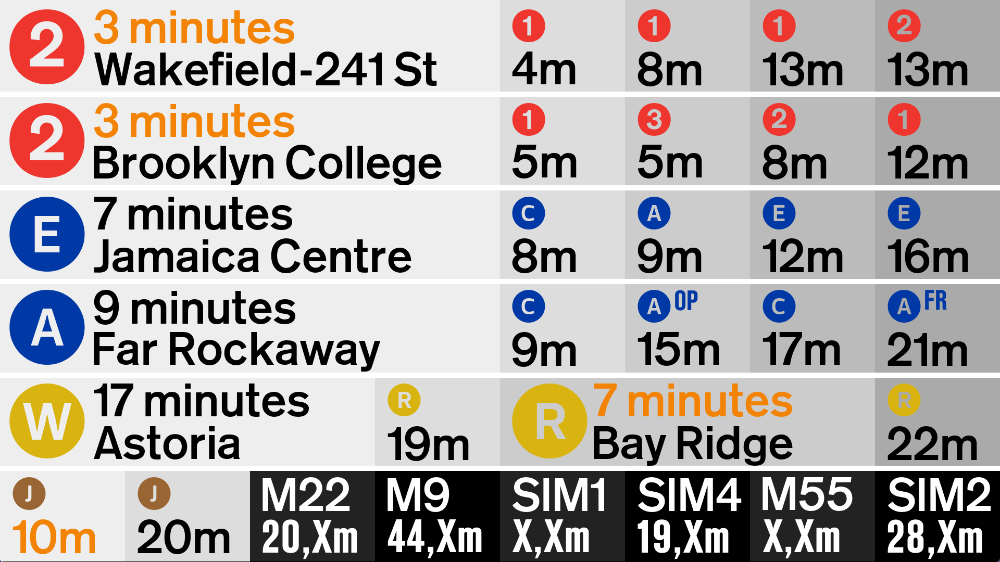

# STUA (Stuyvesant Transit and Urbanism) 
## The STUA Countdown Board Project

---

If you are viewing this, I am assuming you came here to learn more about our countdown clock project for Stuyvesant High School. The STUA has been trying to create some sort of display for the second floor TriBeCa bridge entrance. This display will display subway and bustime information. 

After almost five years in the making, the project is finally done and ready for presentation. Some images of our design are below.

 

(STUA Board Loading Screen)
 
 

(STUA Board Display)
 
 
A main goal in our redesign process was to display as much information as possible in as little rotations as possible. In this way, students would not be clogging the second floor bridge entrance while waiting to view their transit information. Additionally, the board would need to take as little time as possible to download data from the MTA, so that there could be more frequent updates, and hence the information presented on the board would be more accurate. Lastly, we aimed to make the new design simply more appealing to the eye.
 
 
The first two rows display data from the Chambers Street-West Broadway Subway Station, serving the (1)(2)(3) trains. The upper most row shows data for the Uptown and the Bronx direction, while the lower row is for trains heading to South Ferry and Brooklyn. The nearest train to the station is displayed in a larger scale to the left of the board, while the following four trains are shown to the right. When a train is believed to be very close, such that theres a chance that the student may miss the train if they were to leave the school immediately, the train's time is illuminated in orange. Any minute values less than this "critical time" are discarded and the large scale box takes the value of the second most closet train.
 
 
The second two rows display data from the Chambers Street-World Trade Center Station, serving the (A)(C)(E) trains. The upper most row shows data for the Uptown and Queens direction, while the lower row shows data for Brooklyn-bound trains, and (E) trains terminating at the World Trade Center. Downtown (A) trains have an additional indicator rotating between "OP" and "FR" because the (A) train has two terminals in Queens, Ozone Park-Lefferts Blvd and Far Rockaway. During rush hours, "RP" appears, representing Rockaway Park.
 
 
The second to law row contains data from the City Hall station, serving the (R)(W) trains. To the left is Uptown and Queens, to the right is Downtown and Brooklyn. During rush hours, (W) trains terminate at Bay Ridge. At all other times, (W) terminates at Whitehall St-South Ferry.
 
 
The bottom most row contains information for Chambers St (J)(Z) and bus information. (J)(Z) train information is shown for the Brooklyn direction only. Buses were selected according to results from a Stuyvesant bus usage survey. Manhattan buses are in the uptown direction, Staten Island buses are in the Staten Island and Brooklyn direction.